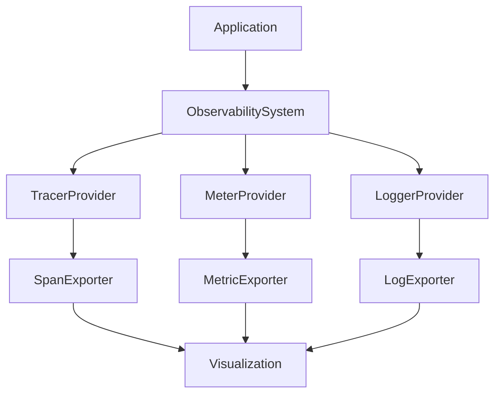

# TypeScript Observability System

A comprehensive observability solution for TypeScript applications, providing integrated tracing, metrics, and logging capabilities with live visualization support.

## 🌟 Features

- **Complete Observability**: Integrated tracing, metrics, and logging
- **Live Visualization**: Real-time visualization of telemetry data
- **OpenTelemetry Compatible**: Built on the OpenTelemetry standard
- **Flexible Configuration**: Extensive configuration options for different environments
- **Production-Ready**: Includes sampling, batching, and proper shutdown handling
- **Type-Safe**: Full TypeScript support with comprehensive type definitions

## 🚀 Installation

```bash
pnpm install simple-observability
```

## 📘 Quick Start

```typescript
import { ObservabilitySystem, ObservabilityConfig } from 'simple-observability';

const config: ObservabilityConfig = {
  serviceName: 'my-service',
  serviceVersion: '1.0.0',
  environment: 'production',
};

const observability = new ObservabilitySystem(config);

// Get telemetry instances
const tracer = observability.getTracer();
const meter = observability.getMeter();
const logger = observability.getLogger();

// Start live visualization
observability.startTraceVisualization();

// Use in your application
const span = tracer.startSpan('operation');
try {
  meter.createCounter('requests').add(1);
  logger.info('Operation started');
  // Your business logic here
  span.end();
} catch (error) {
  logger.error('Operation failed', { error });
  span.recordException(error);
  span.end();
}

// Cleanup
await observability.shutdown();
```

## 🏗️ Architecture

### Design Principles

1. **SOLID Principles**

   - Single Responsibility: Each class has a focused purpose
   - Open/Closed: Extensible through abstractions
   - Interface Segregation: Clean, focused interfaces
   - Dependency Inversion: Configuration injection

2. **Clean Architecture**
   - Core domain is independent of frameworks
   - Dependency flow points inward
   - Clear separation of concerns

### Component Overview



## 🔧 Configuration

### Basic Configuration

```typescript
interface ObservabilityConfig {
  serviceName: string;
  serviceVersion: string;
  environment: string;
  otlpEndpoint?: string;
  samplingRate?: number;
  debug?: boolean;
}
```

### Advanced Options

```typescript
const advancedConfig: ObservabilityConfig = {
  serviceName: 'my-service',
  serviceVersion: '1.0.0',
  environment: 'production',
  otlpEndpoint: 'http://localhost:4318',
  samplingRate: 0.1,
  debug: true,
  customAttributes: {
    'deployment.region': 'us-west-2',
    'team.name': 'platform',
  },
};
```

## 📊 Visualization

### Trace Visualization

```typescript
observability.startTraceVisualization();
// Shows:
// === Trace Hierarchy ===
// └─ HTTP Request (200ms)
//    ├─ Database Query (50ms)
//    └─ Cache Operation (10ms)
```

### Metric Visualization

```typescript
observability.startMetricVisualization();
// Shows:
// === Metrics Dashboard ===
// Requests/sec: ████████████ 120
// Error Rate: █░░░░░░░░░░░ 5%
// Latency (ms): ████████░░░ 150
```

## 🧪 Testing

### Unit Tests

```bash
pnpm run test
```

### Manual Testing

```bash
pnpm run manual-test
```

## 📝 Documentation

Full documentation is available in the `/docs` directory and includes:

- API Reference
- Best Practices
- Example Use Cases
- Troubleshooting Guide

## 🤝 Contributing

1. Fork the repository
2. Select an issue to work on or you can submit a feature request or a code enhancement request see ISSUE_TEMPLATES. For first time contributors there are plenty of issues tagged as `good first issue` These issues are straightforward and easy. This can get you started in open source contribution.
3. Create a branch in this format: `yourusername/typeofchange-issuenumber` ex: `shaiknoorullah/fix-05` for the source branch, select a branch appropriate for that type of change ex: `fixes` for a fix or `features` for a feature.
4. Create a draft PR with what you're working on from the new branch to the target branch ex: `fixes` <= `shaiknoorullah/fix-05`. add the keyword: `[WIP]` in the title so that people know you're working on this. format your PR properly and be descriptive about your change. add context, links to issues, discussions, contributors or comments that are relavant. Write What, why and how of the change.
5. Work on the issue
6. Run tests: `pnpm test`
7. Commit changes: `pnpm commit` select the type of change: `fix | feature | chore | ...` then write the scope of change (filename/foldername) we suggest you to keep your commits small and contained to small tasks and minimum files per commit. Write a short imperative tense description of your change and then optionally a long description as well. Finally add the issue reference, say if this is a breaking change and then press enter to commit.
8. Push to branch: `git push origin your-branch`
9. Once all the changes are complete, and the tests are passing you can now open the Pull Request.
10. Please be patient as it can take a while as the maintainers review your code and merge.

## 📄 License

MIT License - see LICENSE file for details.
